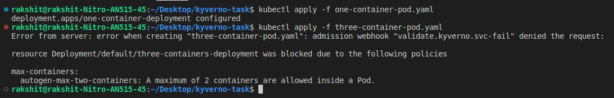
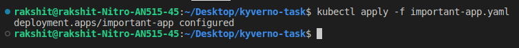

# Task for Policy Exceptions 2.0: LFX'23 Fall project

## Problem statement

- Write a Kyverno policy that limits the amount of containers that can be in a single Pod. The policy should check all pods to ensure that they have no more than two containers. You should show a case where a resource is blocked due to policy violation and another case where a resource is successfully created.
- Use the policy you created in the 1st step to write a Kyverno policy exception that grants an exception to a Pod or Deployment named important-app which will be created in the delta namespace. You should show a case where a resource is successfully created although it violates the policy.

## Solution:

### Pre-requisites:

- A running Kubernetes cluster.
- Helm

### Follow along:

- Install Kyverno inside your Kubernetes Cluster using the following command:
    ```
    helm install kyverno kyverno/kyverno -n kyverno --create-namespace --values ./values.yaml
    ```
    We have a `values.yaml` file inside our repository in which we have the flag `enablePolicyException=true` enabled. By default the value of this flag is `false` but for the `PolicyException` to work, we need to have this enabled.

- Apply the `ClusterPolicy` using the following commad:
    ```
    kubectl apply -f policy.yaml
    ```
    This file has a `ClusterPolicy` defined which checks for the number of Containers inside a Pod, should be not more than 2. If the number of containers defined in a Pod exceeds 2, the validation controller would not allow the resource to be applied to the Kubernetes cluster.

- Test the `ClusterPolicy`:
    ```
    kubectl apply -f one-container-pod.yaml
    ```
    ```
    kubectl apply -f three-container-pod.yaml
    ```
    After running the above two commands, the first command must've succesfully ran. The Deployment `one-container-deployment` must have been properly configured in the cluster.
    On the other side, the second command must've given an error because the number of containers inside this deployment was 3. The Deployment `three-containers-deployment` must not have been deployed in the cluster.

    

- Now that we have seen the `ClusterPolicy` is properly working, their might be some usecases where we might need to create an exception for a certain Deployment or a Pod. To test this,   use the following command to apply a `PolicyException` inside the Cluster.
    ```
    kubectl apply -f exception.yaml
    ```

- After applying the `PolicyException`, a Deployment/Pod named `important-app` in the `delta` namespace would be considered as an exception for our `ClusterPolicy`. Use the following command to aplly one such deployment in the cluster:
    ```
    kubectl create ns delta
    ```
    ```
    kubectl apply -f important-app.yaml
    ```

    After running the above command, a deployment named `important-app` must have been succesfully created in the `delta` namespace, even though this Deployment had 3 containers inside it.

    

### Difficulties faced:

- The first difficulty that I faced was how to enable `PolicyException` for the `kyverno-admission-controller`. I was trying to use this command `helm install kyverno kyverno/kyverno -n kyverno --create-namespace --set "extraArgs={--enablePolicyException=true}"` but was constantly getting a warning that `ClusterPolicy` needs to be enabled. That's where the support of community came in, I was able to tacke this using `helm install kyverno kyverno/kyverno -n kyverno --create-namespace --values ./values.yaml`, Thanks to the folks in the community for helping me out.

- The second difficulty that I faced was how to check for the number of containers inside the Pod. After going through the documentation and lookin for answers, I found this [resource](https://kyverno.io/policies/other/e-l/limit-containers-per-pod/limit-containers-per-pod/), and it was everything I needed to write a proper policy.

- The last difficulty and the most time consuming difficulty that I faced was that the `PolicyException` was not working, even after hundered's of times rechecking, I couldn't identify what was the mistake that I was making. Then I came across this one **Note** on the website that stated that we'll also have to specify the autogenerated rules in the `spec.exceptions.rulesNames`, and I finally figured it out.


Overall, this was an amazing task that gave me a lot of understanding about how things are working in the project and how `PolicyException` is working to be more specific.
